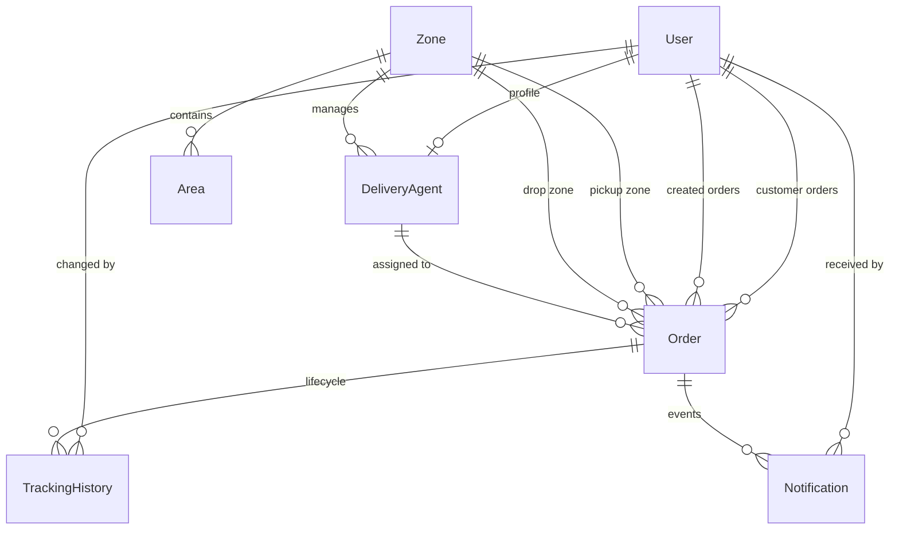

# LastMileUS - System Design Document

This document outlines the architectural blueprints, database designs, algorithmic strategies, and state transition guidelines implemented for the Last-Mile Delivery Tracker logistics platform.

---

## 1. Architectural Overview
The platform is designed following a classic three-tier architecture (Client-Server-Database), optimized for low latency, high throughput, and high reliability in logistics and distribution environments.

```
+--------------------------------------------------------+
|                      React + Vite                      |
|                TypeScript SPA (Frontend)               |
+---------------------------+----------------------------+
                            |
                     REST APIs (HTTPS)
                            |
+---------------------------v----------------------------+
|                  Express.js Backend                    |
|          Controllers, Engines, Middleware Layers       |
+---------------------------+----------------------------+
                            |
                       Prisma Client
                            |
+---------------------------v----------------------------+
|                PostgreSQL Database                     |
|         Zones, Areas, Rates, Orders, History           |
+--------------------------------------------------------+
```

### Key Architectural Decisions:
- **Prisma ORM**: Chosen for type-safe query building and automated database migrations, ensuring compile-time safety across backend services.
- **Express.js API Layer**: Lightweight and robust routing framework, structured with security configurations (Helmet, CORS) and modular folder structure.
- **Vite React SPA**: Selected for rapid hot-module reloading and optimized static asset packaging. Employs vanilla CSS for maximum flexbox-grid control, dynamic neon borders, glassmorphic panel layers, and interactive dashboards.
- **JSON Web Tokens (JWT)**: Handles stateless role-based authentication (`CUSTOMER`, `AGENT`, `ADMIN`) passed via the `Authorization: Bearer` header.

---

## 2. Domain Data Model & Entity Relations
The persistence layer is implemented in PostgreSQL, organized around 8 primary entities. Relational constraints and index strategies are designed to support rapid geo-routing and order lookups.



### Relational Schema Definitions:
1. **User**: Represents all actors (name, email, password hash, role).
2. **Zone**: High-level distribution regions (e.g., North Zone, South Zone).
3. **Area**: Specific neighborhoods/hubs (e.g., Koramangala) mapped to a single Zone with a unique combination of `[name, pincode]`.
4. **RateCard**: Stores tariff rules (`baseRate`, `perKgRate`, `codSurcharge`) mapped uniquely to a combination of `[orderType, zoneType]`.
5. **DeliveryAgent**: Tracks agents, their availability status (`AVAILABLE`, `BUSY`, `OFFLINE`), their current Zone, and active Area.
6. **Order**: The core transaction record, maintaining tracking IDs, dimension weight metrics, auto-calculated charges, and routing zones.
7. **TrackingHistory**: Immutable event log recording status transitions, timestamped, with actor associations and comments.
8. **Notification**: Delivery logs of email or SMS alerts dispatched during order status updates.

---

## 3. Core Business Engines & Logistics Algorithms

### A. Zone Resolution Engine (`zoneEngine.ts`)
When an order is created, the system must translate literal pickup and drop locations into structured zones:
- An exact-match query filters the serviceable areas by `name` (case-insensitive) and `pincode`.
- If either area is not found, the engine throws a `400 Bad Request` declaring the location unserviceable.
- Once zones are resolved, the system calculates the **Zone Type**:
  - `INTRA_ZONE`: Pickup zone matches Drop zone.
  - `INTER_ZONE`: Pickup zone does not match Drop zone.

### B. Dynamic Rate Engine (`rateEngine.ts`)
To prevent volumetric loss (bulky but light packages consuming cargo space), the system enforces standard volumetric weight adjustments:
1. **Volumetric Weight**: Calculated using the industry-standard formula:
   $$\text{Volumetric Weight (kg)} = \frac{\text{Length} \times \text{Breadth} \times \text{Height}}{5000}$$
2. **Billable Weight**: Enforces the maximum threshold:
   $$\text{Billable Weight} = \max(\text{Actual Weight}, \text{Volumetric Weight})$$
3. **Charge Composition**: Looks up the matched `RateCard` for `[orderType, zoneType]`:
   $$\text{Total Charge} = \text{Base Rate} + (\text{Billable Weight} \times \text{Per Kg Rate}) + \text{COD Surcharge}$$

### C. Concurrent Agent Assignment Engine (`assignmentEngine.ts`)
To prevent double-booking agents under high-concurrency order spikes, assignments run within database-level serializable transactions:
1. The engine locks and verifies that the agent's status is strictly `AVAILABLE`.
2. Within the same transaction, the agent is marked as `BUSY` and assigned to the `Order`.
3. If two order threads attempt to assign the same agent simultaneously, the second thread fails with a transition lock error, forcing the system to search for alternative agents safely.

---

## 4. Lifecycle State Machine
Orders follow a strict state transition machine, preventing regression to invalid historical states (e.g., an order cannot go from `DELIVERED` back to `PENDING`).

```
                +------------+
                |  PENDING   |
                +-----+------+
                      |
                +-----v------+
                | PICKED_UP  |
                +-----+------+
                      |
                +-----v------+
                | IN_TRANSIT |
                +-----+------+
                      |
             +--------v--------+
             | OUT_FOR_DELIVERY|
             +--------+--------+
                      |
             +--------+--------+
             |                 |
       +-----v-----+     +-----v-----+
       | DELIVERED |     |  FAILED   |
       +-----------+     +-----+-----+
                               | (Reschedule)
                               v
```

### State Machine Constraints:
- **Terminal States**: `DELIVERED` is a terminal state. Once achieved, no further updates are allowed.
- **Failures & Reschedules**: If an attempt is `FAILED`, the order must remain failed until a customer triggers a reschedule request. The reschedule resets the status to `PENDING`, increments `attemptCount`, releases any assigned agent, and triggers the assignment engine.

---

## 5. Auditing & Immutable Event Sourcing
Instead of overwriting status fields without a trace, the database implements an append-only transaction log model on the `TrackingHistory` table. Every change in order status:
- Creates a new record in `TrackingHistory`.
- Records the precise status, optional operator notes, timestamp, and foreign key reference to the user ID responsible for the update.
- Prevents database updates/deletes on the tracking table via application-level rules, creating a reliable audit log for dispute resolution.

---

## 6. Asynchronous Notification Strategy
To avoid blocking the core order creation or status transition API calls on third-party network requests (e.g., SMTP or SMS gateways), notifications are run asynchronously:
- The notification dispatch helper uses a "fire-and-forget" pattern.
- Failures inside the notification service are caught, logged, and marked as `FAILED` in the database, ensuring that an email/SMS gateway failure never halts the core delivery lifecycle.

---

## 7. Frontend Role-Based View Architecture
The user interface is segmented into three secure dashboard contexts using React Router guards:
- **Customer Dashboard**: Displays order stats, recent activity logs, a live charge estimator form, and a dedicated reschedule option for failed delivery attempts.
- **Agent Dashboard**: A mobile-optimized toggle for setting current status (`AVAILABLE`, `BUSY`, `OFFLINE`) and a checklist of active deliveries with quick-action status transition controls.
- **Admin Dashboard**: A comprehensive control tower allowing CRUD operations on zones, areas, and rate cards, tracking live statistics, overriding order states, and initiating auto-assignments.
