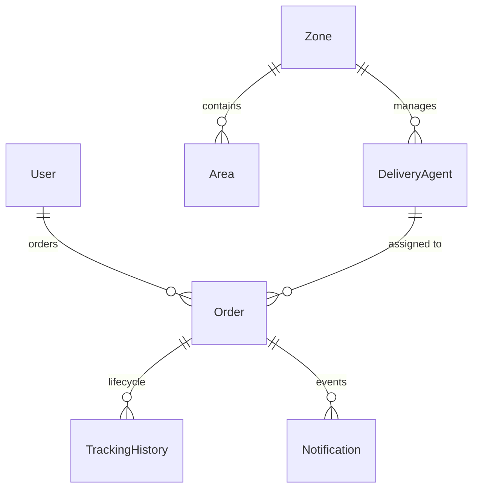

# LastMileUS - System Design Document

## 1. Architectural Overview
The platform uses a classic three-tier architecture optimized for logistics operations.

```
+--------------------------------------------------------+
|                      React + Vite                      |
|                TypeScript SPA (Frontend)               |
+---------------------------+----------------------------+
                            | REST APIs (HTTPS)
+---------------------------v----------------------------+
|                  Express.js Backend                    |
|          Controllers, Engines, Middleware Layers       |
+---------------------------+----------------------------+
                            | Prisma Client
+---------------------------v----------------------------+
|                PostgreSQL Database                     |
+--------------------------------------------------------+
```

**Decisions:**
- **Prisma ORM**: Provides type-safe queries and automated migrations.
- **Express.js API**: Robust routing with security configurations (Helmet, CORS).
- **Vite React SPA**: Selected for fast HMR. Uses vanilla CSS (Glassmorphism).
- **JWT**: Stateless role-based authentication (`CUSTOMER`, `AGENT`, `ADMIN`).

## 2. Domain Data Model
PostgreSQL handles persistence across 8 primary entities.



**Key Entities:**
1. **User**: Roles (`CUSTOMER`, `AGENT`, `ADMIN`), OTP logic.
2. **Zone / Area**: High-level regions containing specific pincodes.
3. **RateCard**: Stores tariff rules (`baseRate`, `perKgRate`) per order/zone type.
4. **DeliveryAgent**: Availability (`AVAILABLE`, `BUSY`) and current Zone.
5. **Order**: Core transaction, pricing, routing zones.
6. **TrackingHistory / Notification**: Immutable event logs and alerts.

## 3. Core Business Engines

### A. Zone Resolution
Translates literal locations into zones using exact `pincode` + `name` matching.
- **INTRA_ZONE**: Pickup matches Drop zone.
- **INTER_ZONE**: Pickup differs from Drop zone.

### B. Dynamic Rate Engine
Enforces standard volumetric weight adjustments.
1. **Volumetric Weight**: `(L × B × H) / 5000`
2. **Billable Weight**: `max(Actual Weight, Volumetric Weight)`
3. **Total Charge**: `Base Rate + (Billable Weight × Per Kg Rate) + COD Surcharge`

### C. Same-Zone Assignment Engine
Agent assignment utilizes a **Same-Zone Matching** algorithm rather than real GPS geo-distance. It pairs orders with agents assigned to the exact same Zone ID, which is a highly efficient simplification for localized dispatching. 
To prevent double-booking under high concurrency, assignment runs within database-level serializable transactions. It locks the agent, marks them `BUSY`, and assigns the order atomically.

## 4. Lifecycle State Machine
Orders follow strict transitions to prevent regression to invalid historical states.

```
PENDING -> PICKED_UP -> IN_TRANSIT -> OUT_FOR_DELIVERY -> DELIVERED / FAILED
```
- **Terminal States**: `DELIVERED` cannot be updated.
- **Reschedules**: If `FAILED`, a customer reschedule resets it to `PENDING`, frees the agent, and triggers reassignment.

## 5. Immutable Event Sourcing
Instead of silently overwriting status fields, changes are logged in `TrackingHistory`. Each change records the status, timestamp, actor, and optional notes. This append-only design creates a reliable audit trail for dispute resolution.

## 6. Asynchronous Notifications
To avoid blocking core APIs on SMTP requests, email notifications run asynchronously. The dispatch helper uses a "fire-and-forget" pattern. Gateway failures are caught and marked as `FAILED` locally, ensuring the core order lifecycle never halts due to network errors.

## 7. Role-Based Views
- **Customer**: Live quotes, order tracking, reschedule triggers.
- **Agent**: Mobile-optimized checklist for status updates and availability toggles.
- **Admin**: Control tower for CRUD on zones/rates, live metrics, and override capabilities.
